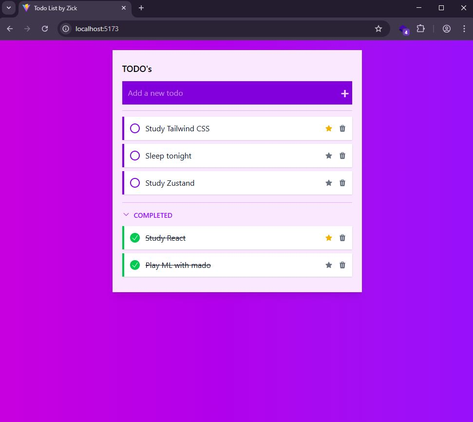

# Todo List App

A simple Todo List application built using modern web development tools.



## 🛠 Tech Stack

- React
- TypeScript
- Tailwind
- Vite

## 📦 How to Run

### 1. Clone the Repository

```bash
git clone https://github.com/exezick/todo-list-app.git
cd todo-list-app
```

### 2. Install Dependencies

```bash
npm install
```

### 3. Start the Development Server

```bash
npm run dev
```

Then open your browser and go to `http://localhost:5173` to view the app.

By: HaielDev
